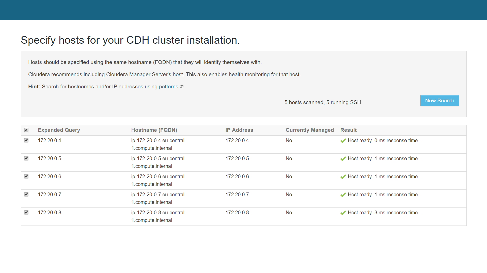
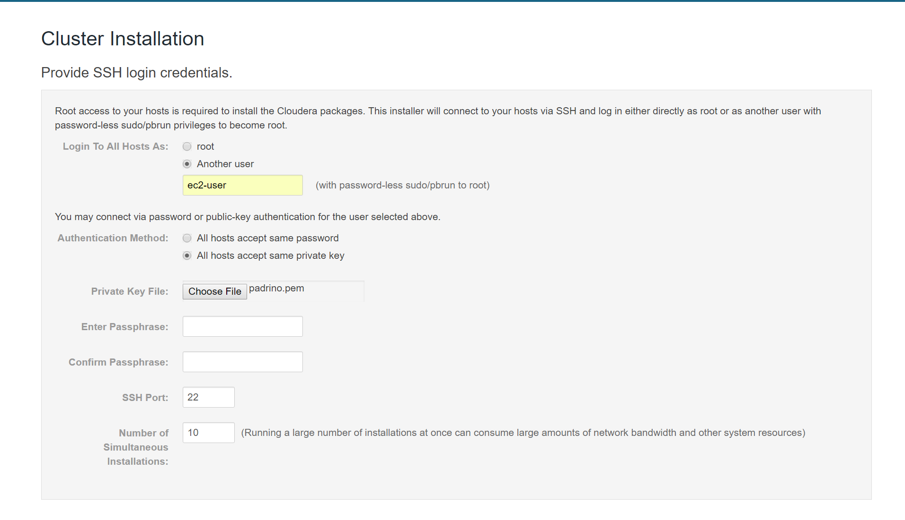
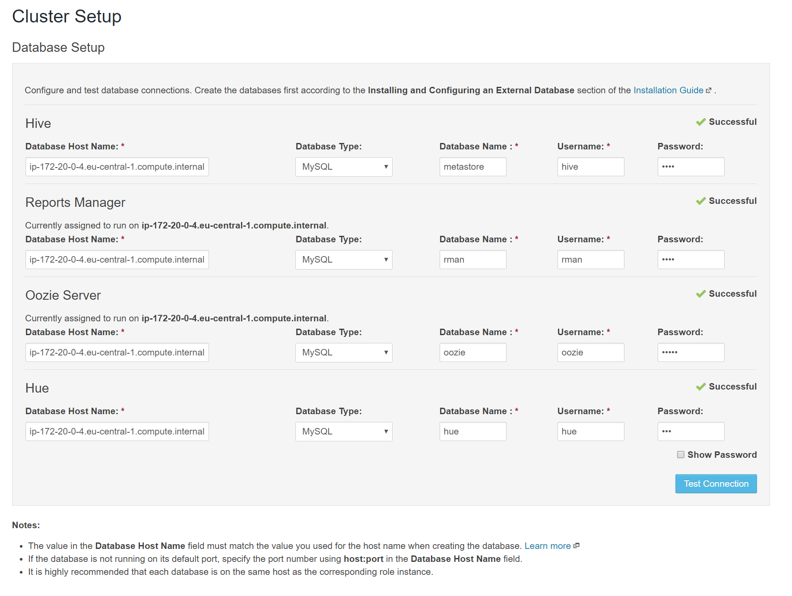

## Installation Cloudera Manager Server Packages
The first step is to add the cloudera manager repos. To do that, the following command has been executed on every node:
```
[ec2-user@ip-172-20-0-4 ~]$ wget https://archive.cloudera.com/cm5/redhat/7/x86_64/cm/cloudera-manager.repo
[ec2-user@ip-172-20-0-4 ~]$ sudo cp cloudera-manager.repo /etc/yum.repos.d
```

The cloudera Manager Server packages are installed on the same node where the database is running, so on padrinocluster1:
```
[ec2-user@ip-172-20-0-4 ~]$ sudo yum install cloudera-manager-daemons cloudera-manager-server -y
```
And ran `scm_prepare_database.sh`:
```
/usr/share/cmf/schema/scm_prepare_database.sh -u root -preskuf90 mysql scm scm scm
```
Once the database is configured, we can start the cloudera server service:
```
[ec2-user@ip-172-20-0-4 ~]$ sudo service cloudera-scm-server start
```

## Installation Cloudera manager agents
After the service is started, we can browse to http://padrinocluster1:7180 to access cloudera manager and start the installation of the agents. 
The first step is to search for the hosts of the cluster, this is easily done by searching for hosts with the ip in the range 172.20.0.[4-8].

After selecting the hosts, select the authentication method:


When the installation is done, select the roles to install on the hosts as following:


And setup the databases connection using the previously set credentials:


In the next page leave default settings and wait for the services to be deployed and started.

Once it started, you can check the status of CM on http://padrinocluster1:7180
